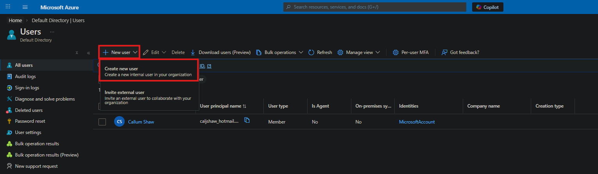
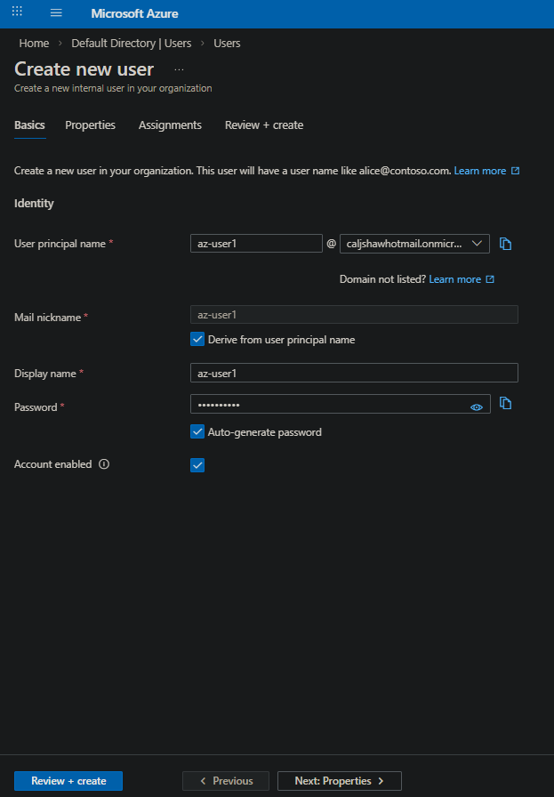
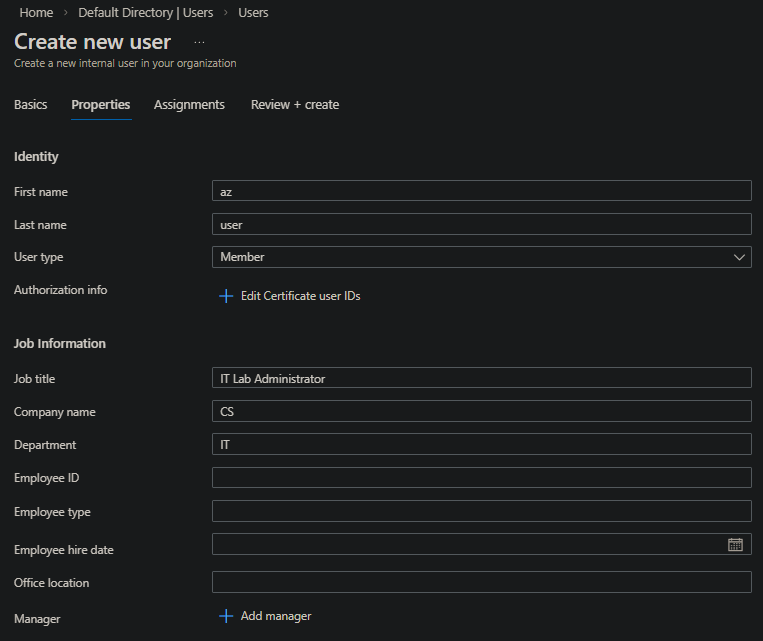
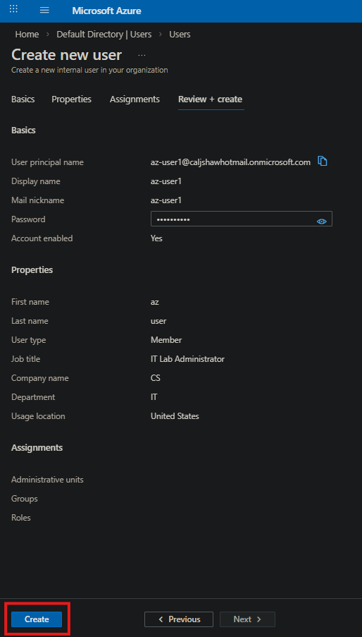
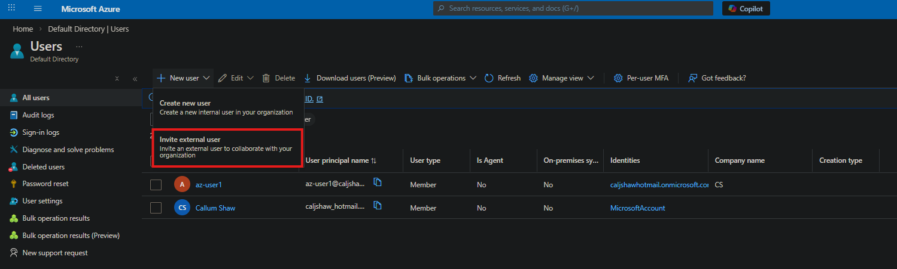
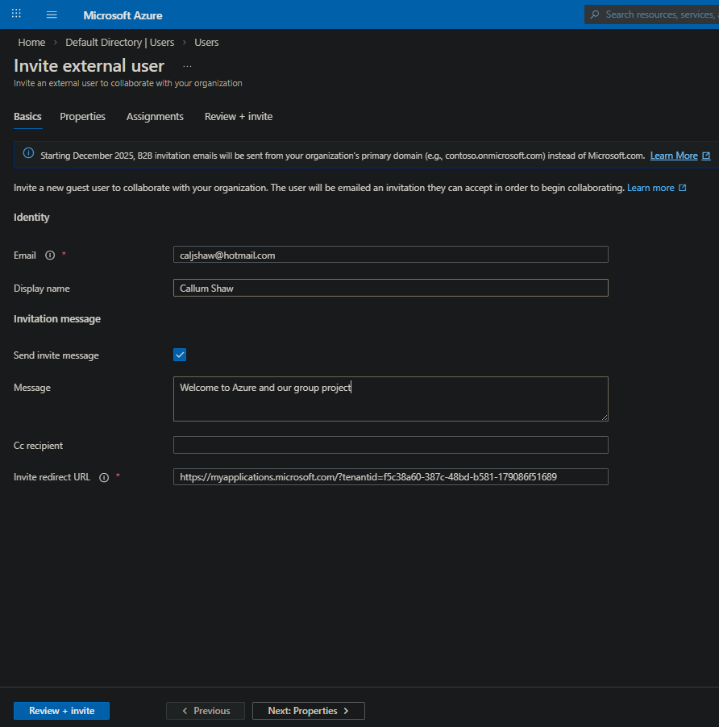
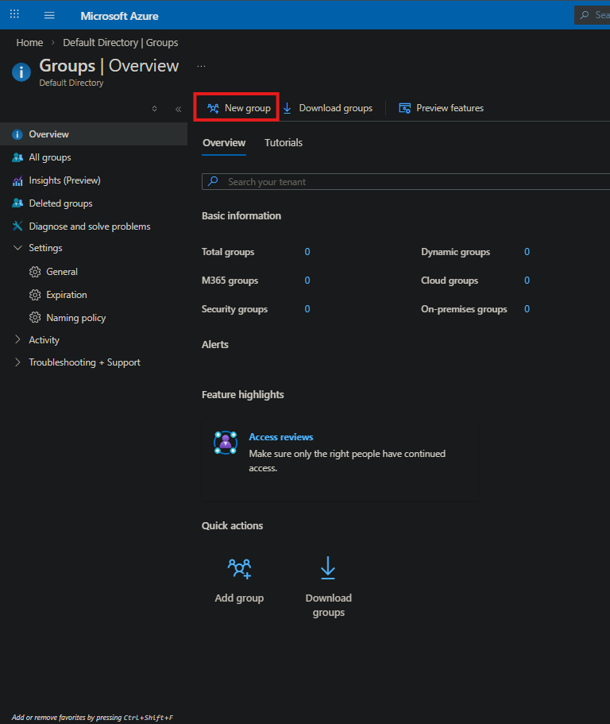
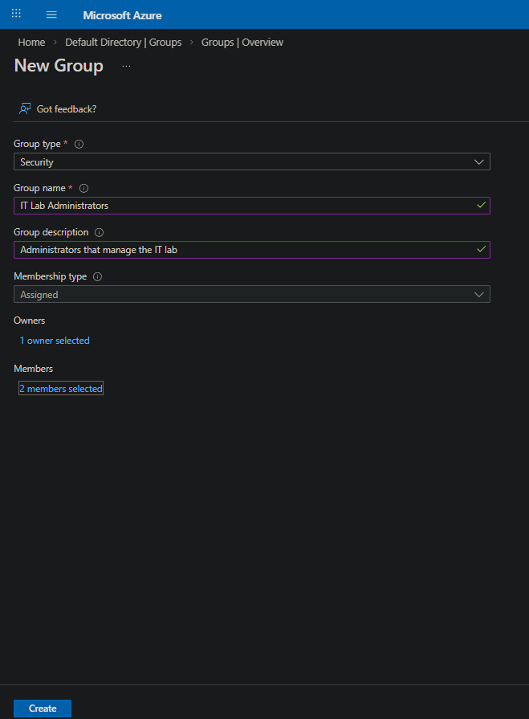
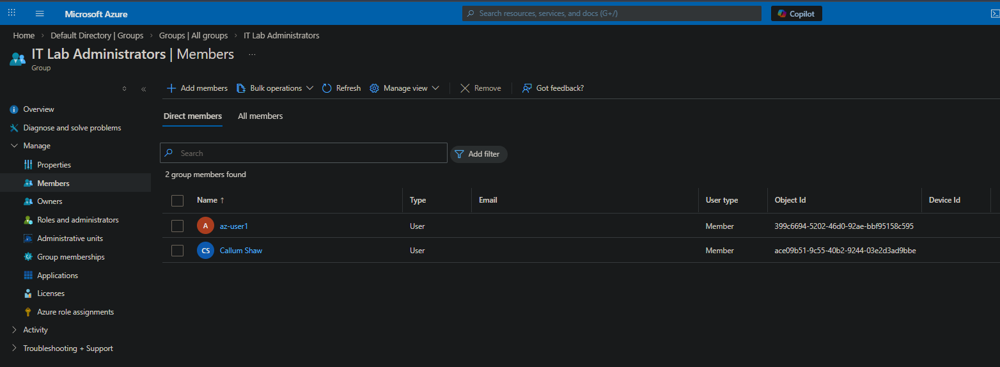

# Lab 01 - Entra ID User and Group Management

## Objective
Create users, invite a guest user, and manage access using a security group.

---

## Step 1 - Create Internal User

- Went to Azure Portal → Entra ID → Users  
- Clicked "New user"  
- Selected "Create new user"  

---

## Step 2 - Enter User Details

- Set username (az-user1)  
- Set display name  
- Enabled auto-generated password  

---

## Step 3 - Configure Properties

- Added job title  
- Added department  

---

## Step 4 - Review and Create User

- Reviewed configuration  
- Clicked "Create"  

---

## Step 5 - Invite Guest User

- Selected "Invite external user"  
- Entered email address  
- Added display name  

---

## Step 6 - Create Security Group

- Went to Groups  
- Clicked "New group"  
- Selected Security group  

---

## Step 7 - Configure Group Details

- Named group: IT Lab Administrators  
- Set membership type to Assigned  

---

## Step 8 - Add Members

- Added internal user  
- Added guest user  

---

## Step 9 - Verify Group Members

- Checked both users were added successfully  

---

## Summary

- Created an internal user  
- Invited a guest user  
- Created a security group  
- Added users to the group  
