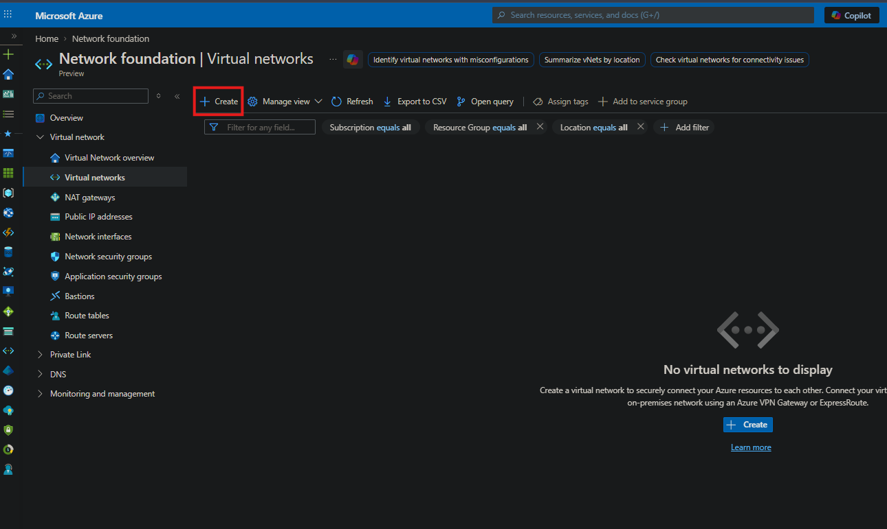
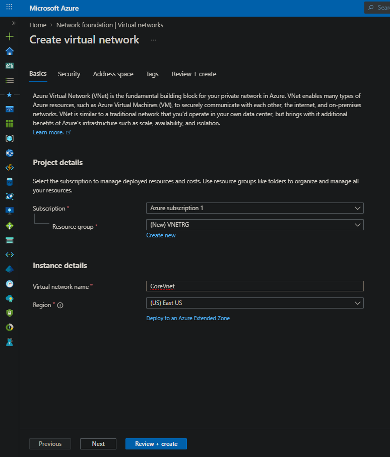
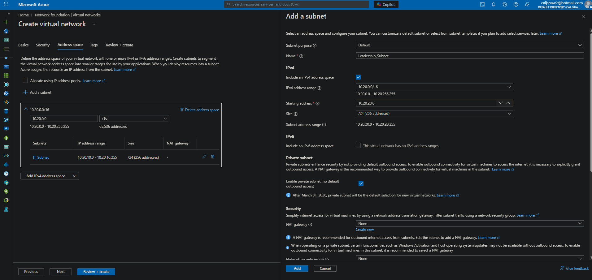
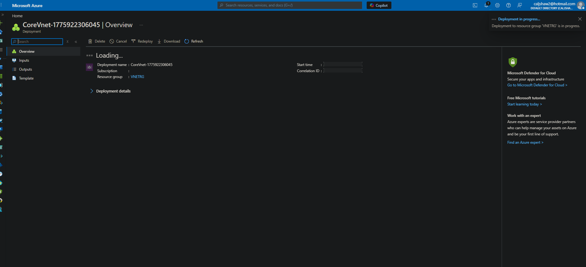
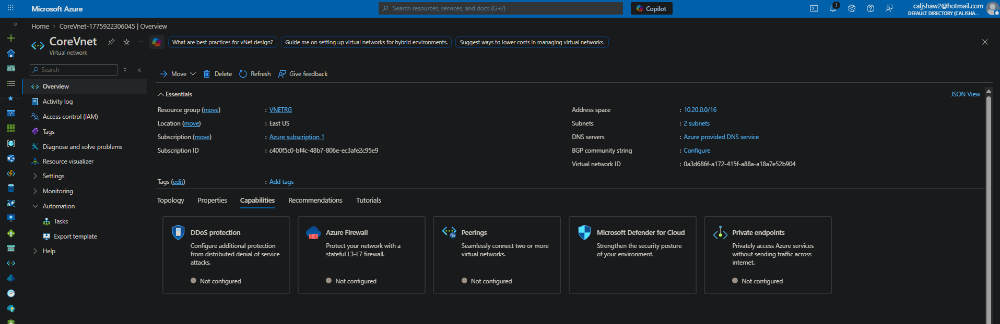

# Lab 02 - Azure Virtual Network (VNet) Creation

## Objective  
Create a virtual network in Azure, define an address space, and configure subnets.

---

## Step 1 - Navigate to Virtual Networks

- Went to Azure Portal  
- Searched for **Virtual networks**  
- Selected **Create**

---

## Step 2 - Configure Basics

- Selected subscription  
- Chose resource group (VNETRG)  
- Set virtual network name (CoreVnet)  
- Selected region (East US)  

---

## Step 3 - Configure Address Space

- Set IPv4 address space to **10.20.0.0/16**  
- Reviewed available IP range  
- Prepared to segment network into subnets  

---

## Step 4 - Create Subnet

- Added new subnet  
- Named subnet: **Leadership_Subnet**  
- Set subnet range to **10.20.20.0/24**  
- Enabled private subnet setting (no default outbound access)  

---

## Step 5 - Deploy and Review VNet

- Reviewed configuration  
- Deployed virtual network  
- Verified address space and subnet creation  

---

## Summary

- Created a virtual network in Azure  
- Defined a custom IP address space  
- Created and configured a subnet  
- Deployed and validated the network configuration  
