# Lab 04 - Azure Network Security Groups (NSG) and Application Security Groups (ASG)

## Objective  
Create an Application Security Group and Network Security Group, associate the NSG with a subnet, and configure inbound and outbound security rules.

---

## Step 1 - Create Application Security Group (ASG)

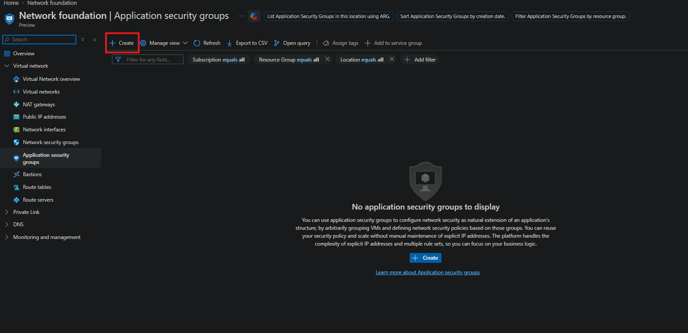

- Navigated to **Application security groups**  
- Clicked **Create**  

---

## Step 2 - Configure ASG Details

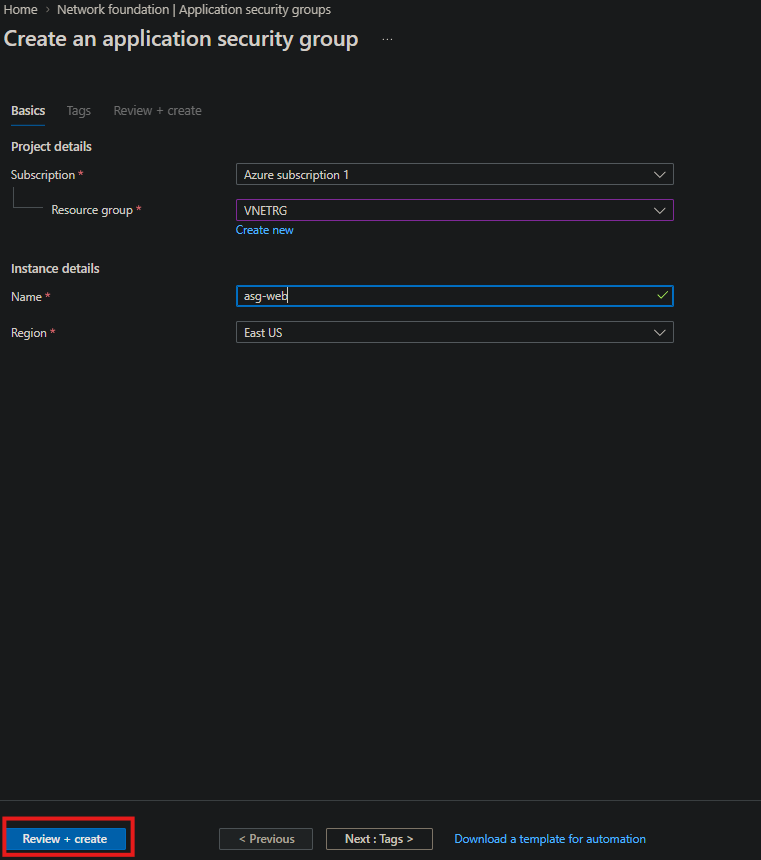

- Selected subscription  
- Chose resource group (VNETRG)  
- Named ASG: **asg-web**  
- Selected region (East US)  
- Clicked **Review + create**  

---

## Step 3 - Create Network Security Group (NSG)

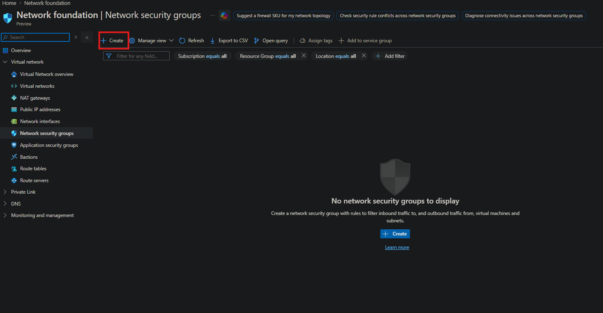

- Navigated to **Network security groups**  
- Clicked **Create**  

---

## Step 4 - Configure NSG Details

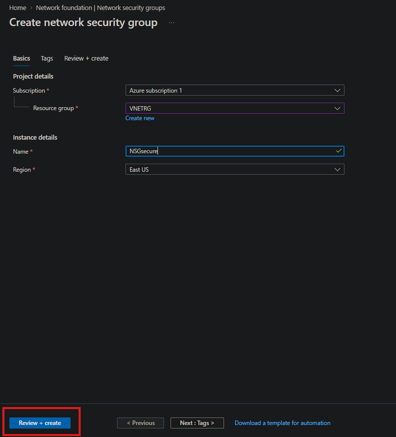

- Selected subscription  
- Chose resource group (VNETRG)  
- Named NSG: **NSGsecure**  
- Selected region (East US)  
- Clicked **Review + create**  

---

## Step 5 - Access Deployed NSG

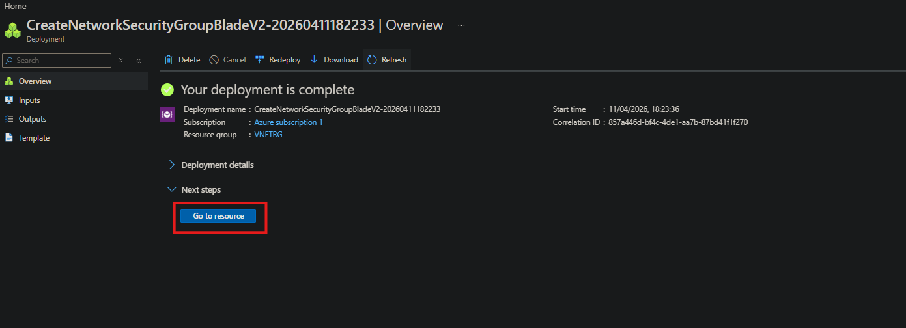

- Waited for deployment to complete  
- Clicked **Go to resource**  

---

## Step 6 - Navigate to Subnets

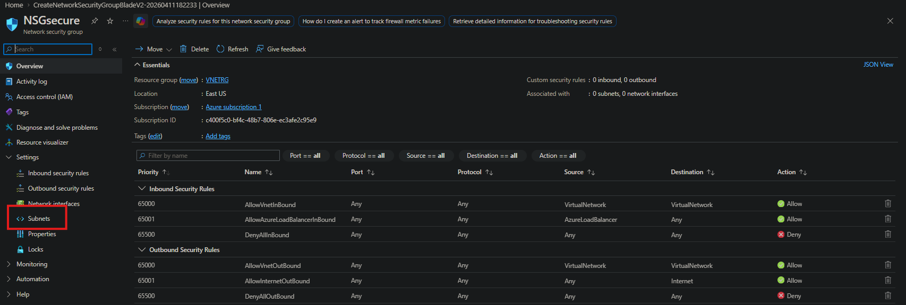

- Selected **Subnets** under Settings  
- Prepared to associate NSG with a subnet  

---

## Step 7 - Associate NSG with Subnet

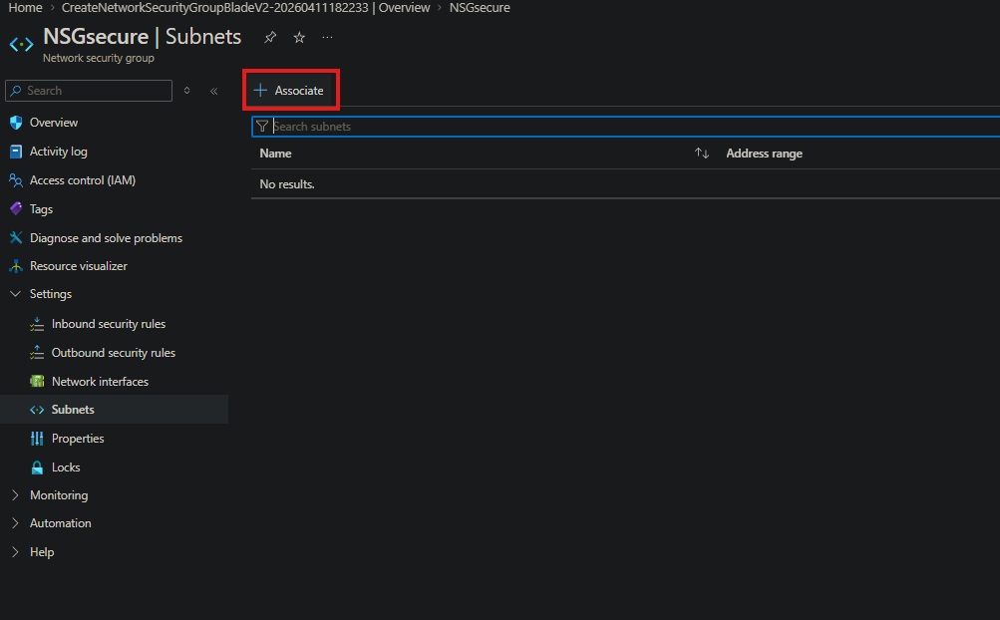
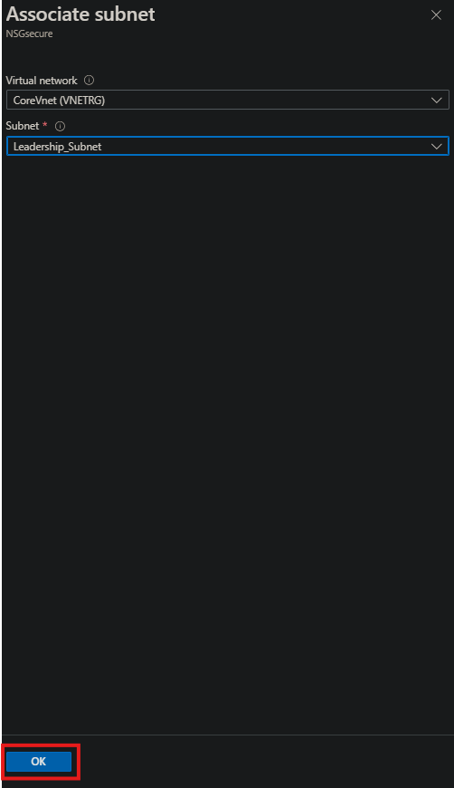

- Clicked **Associate**  
- Selected:
  - Virtual network: **CoreVnet**  
  - Subnet: **Leadership_Subnet**  
- Clicked **OK**  

---

## Step 8 - Create Inbound Security Rule

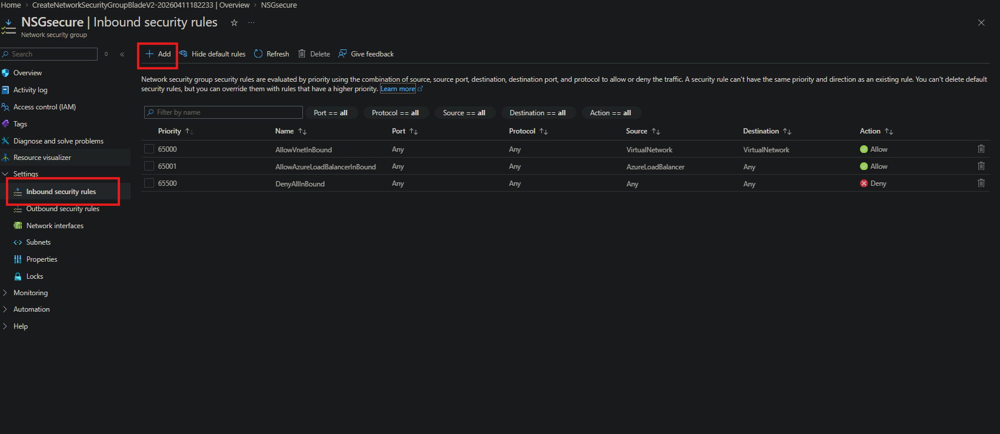
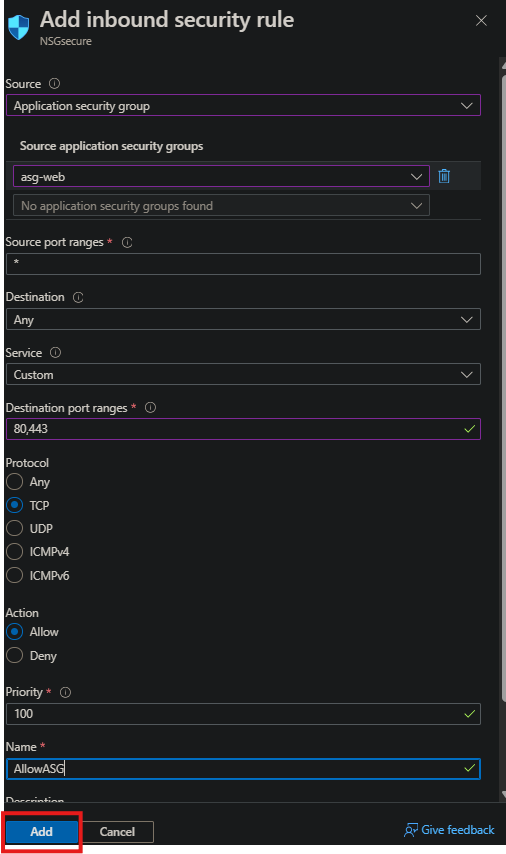

- Navigated to **Inbound security rules**  
- Clicked **Add**  
- Configured rule:
  - Source: Application Security Group (**asg-web**)  
  - Ports: **80, 443**  
  - Protocol: **TCP**  
  - Action: **Allow**  
  - Priority: **100**  
  - Name: **AllowASG**  
- Clicked **Add**  

---

## Step 9 - Create Outbound Security Rule

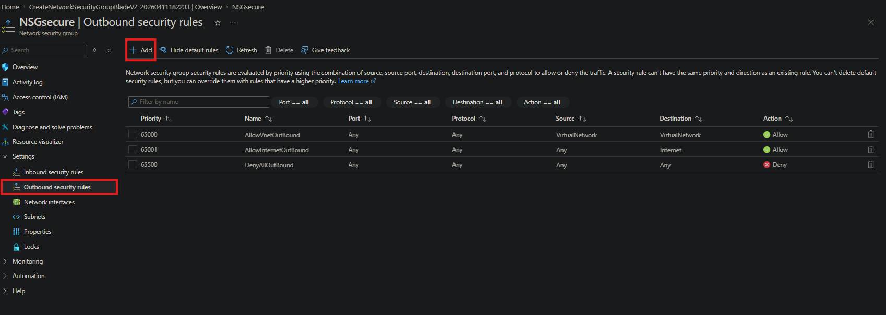
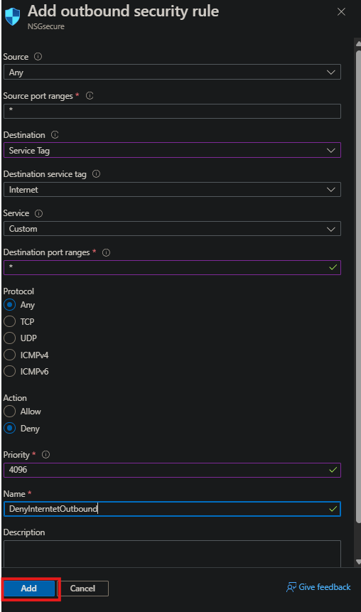

- Navigated to **Outbound security rules**  
- Clicked **Add**  
- Configured rule:
  - Destination: **Internet (Service Tag)**  
  - Ports: **Any**  
  - Protocol: **Any**  
  - Action: **Deny**  
  - Priority: **4096**  
  - Name: **DenyInternetOutbound**  
- Clicked **Add**  

---

## Step 10 - Verify Security Rules

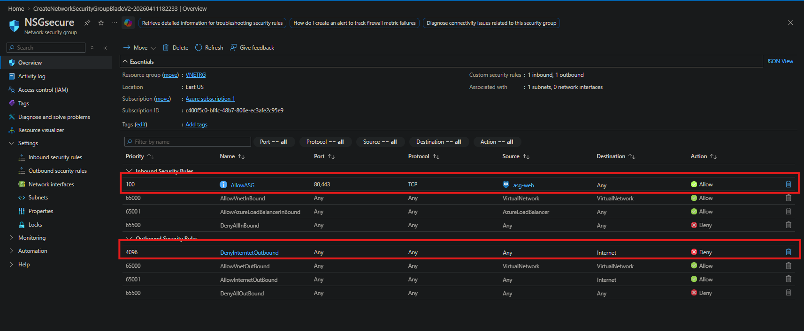

- Reviewed NSG configuration  
- Confirmed:
  - Inbound rule allowing ASG traffic  
  - Outbound rule denying internet access  

---

## Summary

- Created an Application Security Group (ASG)  
- Created a Network Security Group (NSG)  
- Associated NSG with a subnet  
- Configured inbound rule to allow web traffic from ASG  
- Configured outbound rule to block internet access  
- Verified rules were successfully applied
