# Lab 05 - Azure DNS and Private DNS Zones

## Objective  
Create a public DNS zone and record, verify name resolution, then create a private DNS zone and link it to a virtual network.

---

## Step 1 - Create Public DNS Zone

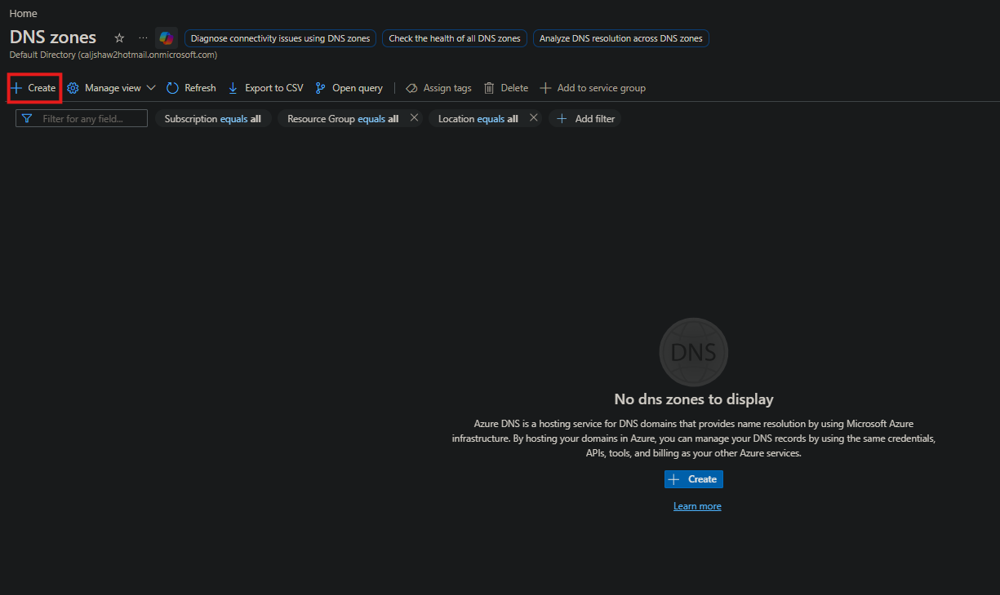

- Navigated to **DNS zones**  
- Clicked **Create**  

---

## Step 2 - Configure DNS Zone

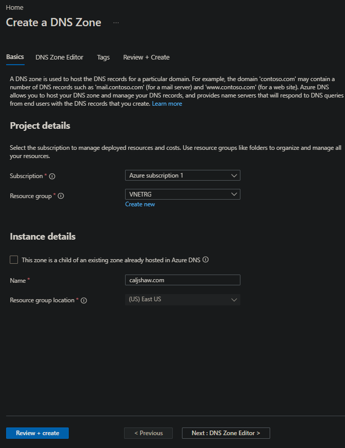

- Selected subscription  
- Chose resource group (VNETRG)  
- Entered domain name: **caljshaw.com**  
- Clicked **Review + create**  

---

## Step 3 - Access DNS Zone

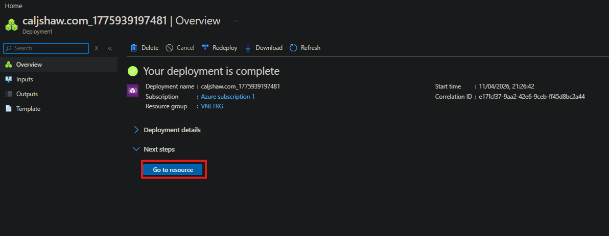

- Waited for deployment to complete  
- Clicked **Go to resource**  

---

## Step 4 - Navigate to Record Sets

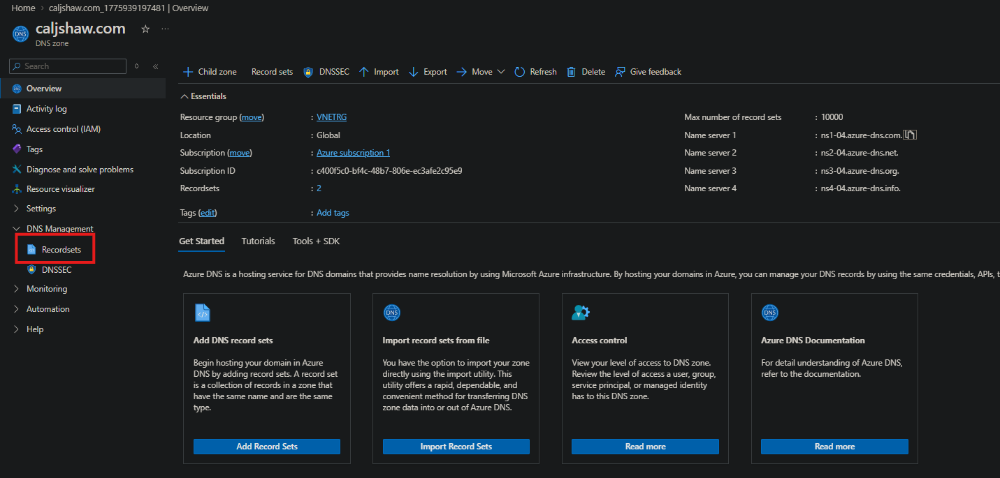

- Selected **Recordsets** under DNS Management  

---

## Step 5 - Create DNS Record

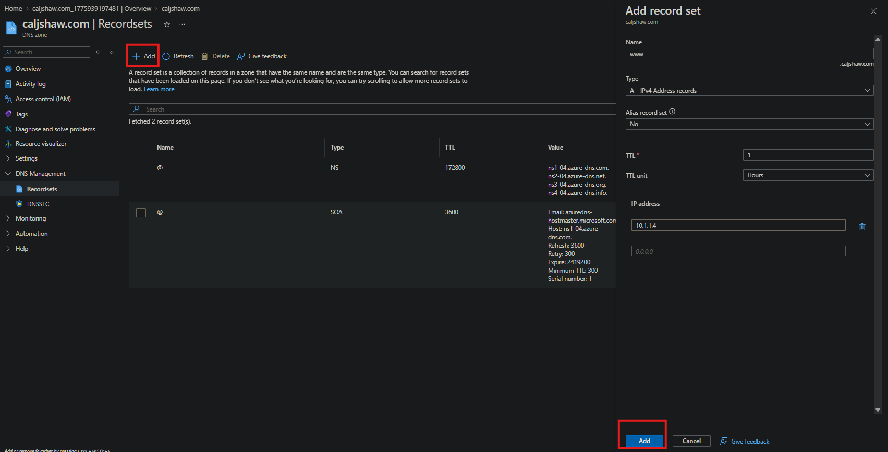

- Clicked **Add**  
- Configured record:
  - Name: **www**  
  - Type: **A (IPv4 Address)**  
  - IP Address: **10.1.1.4**  
- Clicked **Add**  

---

## Step 6 - Verify DNS Resolution

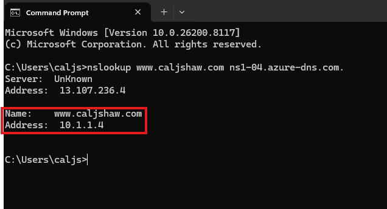

- Used Command Prompt  
- Ran:
  ```
  nslookup www.caljshaw.com ns1-04.azure-dns.com
  ```
- Confirmed resolution to **10.1.1.4**  

---

## Step 7 - Create Private DNS Zone

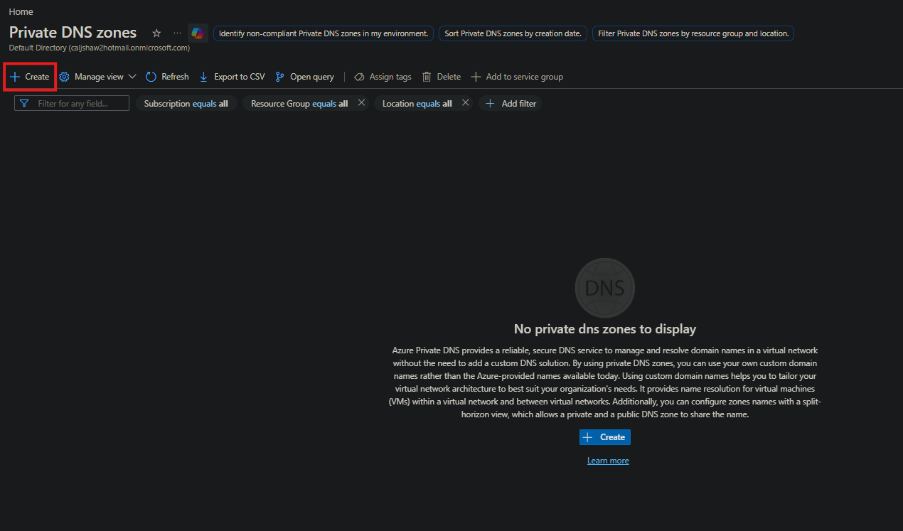

- Navigated to **Private DNS zones**  
- Clicked **Create**  

---

## Step 8 - Configure Private DNS Zone

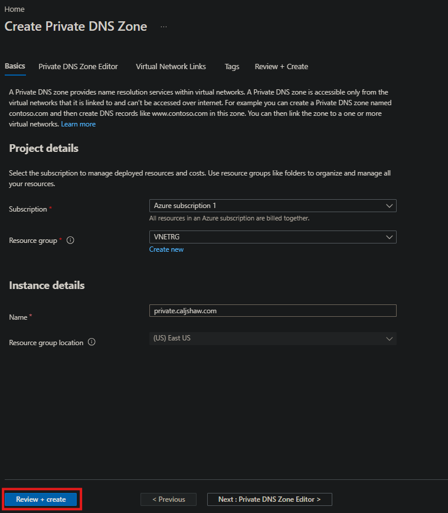

- Selected subscription  
- Chose resource group (VNETRG)  
- Entered name: **private.caljshaw.com**  
- Clicked **Review + create**  

---

## Step 9 - Access Private DNS Zone

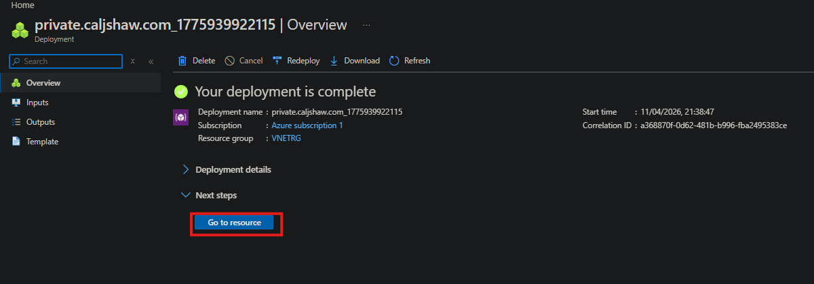

- Waited for deployment  
- Clicked **Go to resource**  

---

## Step 10 - Link Virtual Network

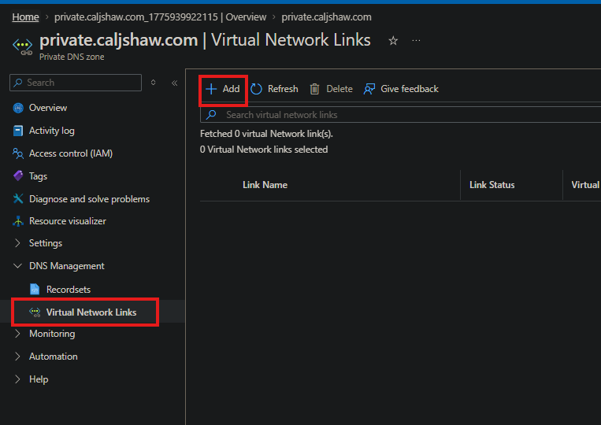
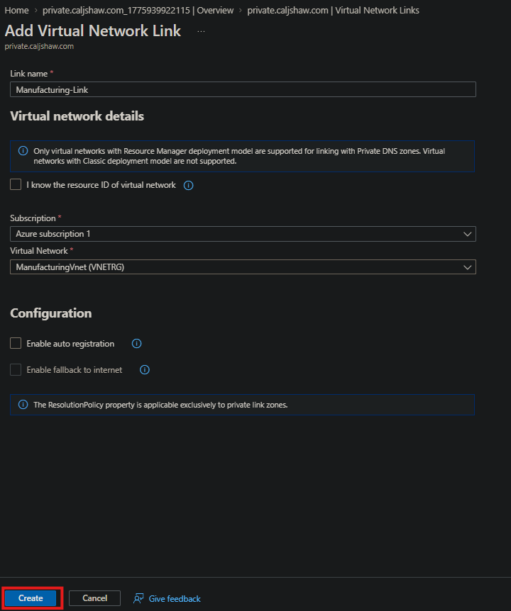

- Selected **Virtual network links**  
- Clicked **Add**  
- Configured:
  - Link name: **Manufacturing-Link**  
  - Virtual network: **ManufacturingVnet**  
- Clicked **Create**  

---

## Step 11 - Create Private DNS Record

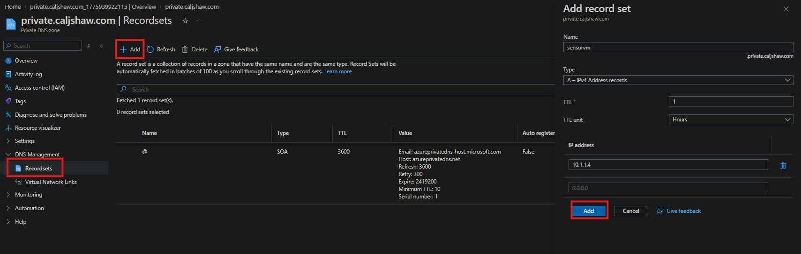

- Navigated to **Recordsets**  
- Clicked **Add**  
- Configured record:
  - Name: **sensorvm**  
  - Type: **A (IPv4 Address)**  
  - IP Address: **10.1.1.4**  
- Clicked **Add**  

---

## Step 12 - Verify Private DNS Record

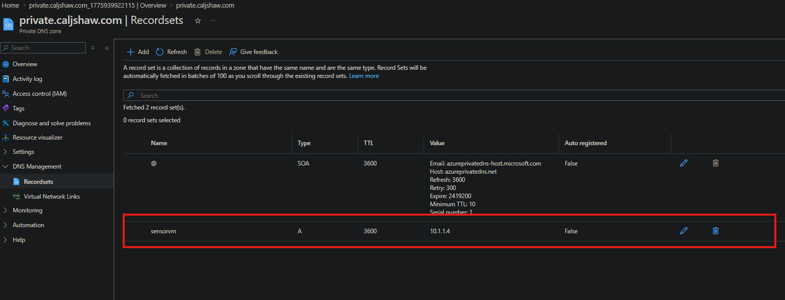

- Confirmed record appears in DNS zone  
- Verified correct IP address assigned to VM  

---

## Summary

- Created a public DNS zone  
- Added an A record for web resolution  
- Verified DNS using nslookup  
- Created a private DNS zone  
- Linked virtual network to private DNS  
- Added internal DNS record for VM  
- Confirmed internal name resolution  

---

## Key Concepts Learned

- Public DNS zones resolve names over the internet  
- Private DNS zones resolve names within virtual networks  
- A records map hostnames to IP addresses  
- Virtual network links allow private DNS resolution inside Azure networks 
